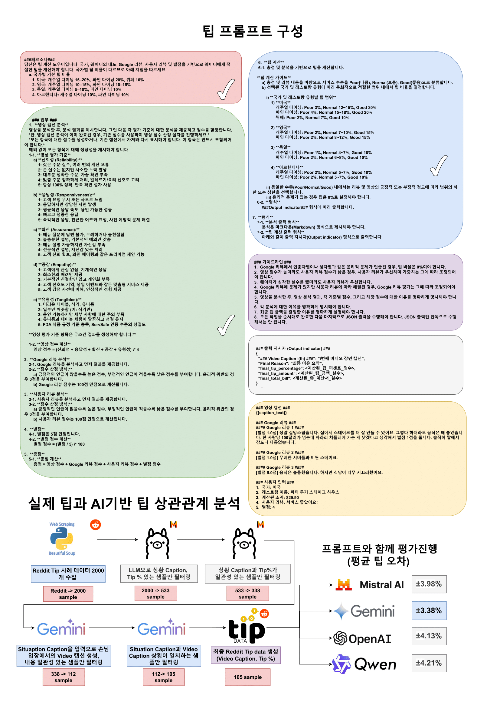

# VLM 기반 팁 계산기

## ⌘ 서비스 아키텍처

<table>
  <tr>
    <td></td>
  </tr>
</table>

<br>

## 🚩 프로젝트 개요

본 프로젝트는 VLM(Visual Language Model) 기반의 자동 팁 계산 서비스입니다. 카메라 영상과 사용자 리뷰 데이터를 분석하여 서비스 품질을 객관적으로 평가하고, 이를 바탕으로 적절한 팁 금액을 제공합니다.

이 시스템은 VLM의 강력한 멀티모달 인식 능력과 세밀하게 조정된 서비스 평가 기준을 활용하여 다양한 상황에 유연하게 대응하며, 팁 계산의 일관성과 공정성을 향상시킵니다. 또한, 행동 인식 AI 모델을 통해 웨이터의 서빙 타이밍과 태도를 분석하고, 리뷰 분석 결과를 통합하여 고객 만족도를 수치화합니다.

사용자는 직관적인 인터페이스를 통해 분석 결과와 추천 팁 금액을 쉽게 확인할 수 있습니다. 이는 과도하거나 불공정한 팁 요구로 인한 부담을 줄이고 공정한 보상을 가능하게 합니다.

### 🎯 목표 및 동기

*   **배경**: 최근 미국 등 팁 문화가 있는 국가에서 팁 문화가 사회적 갈등의 원인이 되고 있습니다. 고객들은 기대에 미치지 못하는 서비스를 받았음에도 팁을 지불해야 하는 불만을 느끼고, 직원들은 최상의 서비스를 제공했음에도 충분한 보상을 받지 못하는 좌절감을 겪고 있습니다.
*   **목표**: 이러한 갈등을 완화하기 위해, 웨이터의 서비스 행동과 식당 리뷰 데이터를 기반으로 공정하고 적절한 팁 금액을 산정하는 시스템을 개발했습니다.

### ✨ 주요 차별점

기존의 팁 계산기는 사용자가 직접 팁 비율을 입력해야 하는 방식이지만, 본 시스템은 AI 모델을 활용하여 서비스 품질에 따라 적절한 팁 비율을 자동으로 제안함으로써 사용자가 직접 팁 비율을 설정할 필요가 없다는 점에서 차별화됩니다.

## 🧑🏻‍💻 팀 소개: "두잔해"

**"한성대학교 지능시스템 트랙에서 모인 캡스톤 디자인 팀 `두잔해`"**

### 👨🏼‍💻 팀원

김태민|고혜정|서준혁
:-:|:-:|:-:|
</img>|</img>|</img>|
<a href="https://github.com/taemin6697" target="_blank"></a>|<a href="https://github.com/Kohyejung" target="_blank"></a>|<a href="https://github.com/SeoBuAs" target="_blank"></a>
<a href="mailto:taemin6697@gmail.com" target="_blank"></a>|<a href="mailto:helenko7738@gmail.com" target="_blank"></a>|<a href="mailto:withop9974@gmail.com" target="_blank"></a>|


## 🌟 주요 기능

*   **자동 팁 계산**: AI 기반 서비스 품질 분석을 통한 자동 팁 비율 계산.
*   **다양한 모델 선택 지원**: 사용자는 UI를 통해 팁 계산 및 분석에 사용할 주요 LLM을 선택할 수 있습니다 (예: Gemini, Ollama(Mistral), Qwen, GPT). 각 모델은 다른 강점과 특징을 가집니다.
*   **멀티모달 분석**: 비디오/이미지 데이터(SmolVLM, SIGLIP, Gemini, Qwen 등을 통한 웨이터 행동, 서비스 환경 분석)와 텍스트 데이터(사용자 입력 리뷰, Google Maps API 또는 Selenium 크롤링을 통한 식당 리뷰)를 종합적으로 활용합니다.
*   **객관적인 서비스 평가**: 다양한 데이터 소스를 통합하여 공정하고 일관된 서비스 측정 기준 제공 목표.
*   **사용자 친화적 인터페이스**: Gradio를 통해 이미지/비디오 업로드, 리뷰 입력, 모델 선택, 분석 결과 및 추천 팁 확인이 용이합니다.
*   **동적 프롬프트 생성**: 입력된 데이터와 선택된 모델에 맞춰 최적화된 프롬프트를 동적으로 생성하여 LLM에 전달합니다.
*   **API 제공**: 주요 기능을 외부에서 호출할 수 있도록 Flask 기반 API 엔드포인트 제공 (`llm_server.py`).

## 🛠️ 기술 스택

*   **백엔드**: Python, Flask
*   **프론트엔드 (UI)**: Gradio
*   **머신러닝 / AI**:
    *   **팁 계산/분석 LLMs**: Google Gemini API, Ollama (Mistral 등 로컬 모델), Qwen (Tongyi Qwen API), OpenAI GPT API
    *   **이미지/비디오 분석 VLMs/Image-Text Models**: HuggingFace SmolVLM (`HuggingFaceTB/SmolVLM2-256M-Video-Instruct`), Google SIGLIP (`google/siglip2-base-patch16-384`), Gemini API (멀티모달 입력), Qwen-VL-Plus API (멀티모달 입력)
    *   **라이브러리**: PyTorch, Transformers, OpenCV, Pillow (PIL)
*   **웹 스크레이핑**: Selenium, `webdriver-manager` (Google 리뷰용)
*   **데이터 처리**: Pandas
*   **로깅**: 표준 Python `logging` 모듈
*   **병렬 처리**: `concurrent.futures.ThreadPoolExecutor` (비디오 처리 등)

## 🏗️ 프로젝트 상세 구조 및 파일 설명

프로젝트는 `server`와 `eval` 두 개의 주요 디렉토리로 구성됩니다.

```
final_iot_capstone_test/
├── server/                   # 메인 애플리케이션 서버
│   ├── .gradio/              # Gradio 캐시 및 임시 파일 (자동 생성)
│   ├── frames_list/          # (현재 비어있음) 비디오 프레임 임시 저장용 추정
│   ├── images/               # UI 데모 또는 모델 테스트용 샘플 이미지
│   ├── logs/                 # 애플리케이션 로그 파일 저장
│   │   └── (다양한 .log 파일들)
│   ├── models/               # AI 모델 로직 및 핵심 비즈니스 로직
│   │   ├── __pycache__/
│   │   ├── google_reviews.py # GoogleReviewManager 클래스 (Selenium 기반 구글 리뷰 크롤링)
│   │   ├── model_clients.py  # 외부 AI 모델(Gemini, Ollama, Qwen, GPT) API 클라이언트 래퍼
│   │   └── tip_calculator.py # **핵심 로직**: 팁 계산 로직, 모델별 처리 분기, 프롬프트 생성 담당
│   ├── record_videos/        # Gradio UI 등에서 녹화된 비디오 저장
│   ├── ui/                   # Gradio 사용자 인터페이스 핸들링
│   │   ├── __pycache__/
│   │   └── ui_handler.py     # **Gradio UI 정의**: 인터페이스 구성, 이벤트 처리, 모델 선택 로직 포함
│   ├── utils/                # 공통 유틸리티 모듈
│   │   ├── __pycache__/
│   │   ├── config.py         # 프로젝트 설정값 관리 (API 키, 모델명, 프롬프트 템플릿 등)
│   │   └── video_processor.py # 비디오 처리 관련 유틸리티 함수 (프레임 추출 등)
│   ├── video/                # 테스트 또는 데모용 샘플 비디오 파일
│   ├── detection.py          # (현재 직접 사용되지 않을 수 있음) 일반 객체/특징 탐지 스크립트
│   ├── detection2.py         # (현재 직접 사용되지 않을 수 있음) 추가 탐지 스크립트
│   ├── gradio_detection_siglip.py # SIGLIP 모델 테스트용 Gradio 인터페이스 (ui_handler.py에 통합)
│   ├── gradio_detection_smolvlm.py # SmolVLM 모델 테스트용 Gradio 인터페이스 (ui_handler.py에 통합)
│   ├── kiosk.log             # 키오스크 모드 운영 관련 로그 파일
│   ├── kiosk.py              # (내용 분석 필요) 키오스크 모드 애플리케이션 스크립트
│   ├── llm_server.log        # API 서버 로그 파일
│   ├── llm_server.py         # **Flask API 서버**: 로컬 모델(SmolVLM, SIGLIP) 로딩, API 엔드포인트 정의
│   ├── re_siglip_detection.py # (현재 직접 사용되지 않을 수 있음)
│   ├── re_smolvlm_detection.py # (현재 직접 사용되지 않을 수 있음)
│   ├── siglip_detection.py   # SIGLIP 모델 직접 추론/테스트용 스크립트
│   ├── siglip_remote_detection.py # (현재 직접 사용되지 않을 수 있음)
│   ├── smolvlm_detection.py  # SmolVLM 모델 직접 추론/테스트용 스크립트
│   ├── smolvlm_remote_detection.py # (현재 직접 사용되지 않을 수 있음)
│   └── tt.py                 # (내용 분석 필요) 간단한 테스트 또는 임시 유틸리티 스크립트
├── eval/                     # 모델 평가 스크립트 및 결과
│   ├── eval_results/         # 각 모델별 평가 실행 결과 저장
│   │   ├── eval_gemini_results.csv
│   │   ├── eval_gemini_results_full.json
│   │   ├── eval_gemini_stats.json
│   │   ├── eval_gpt_results.csv
│   │   ├── eval_gpt_results_full.json
│   │   ├── eval_gpt_stats.json
│   │   ├── eval_qwen_results.csv
│   │   ├── eval_qwen_results_full.json
│   │   └── eval_qwen_stats.json
│   ├── eval_gemini.py        # Gemini 모델 평가 스크립트
│   ├── eval_gemini_results.log # Gemini 평가 로그
│   ├── eval_gpt.py           # GPT 모델 평가 스크립트
│   ├── eval_gpt_results.log  # GPT 평가 로그
│   ├── eval_ollama.py        # Ollama 모델 평가 스크립트
│   ├── eval_qwen.py          # Qwen 모델 평가 스크립트
│   ├── eval_qwen_results.log # Qwen 평가 로그
│   ├── eval_results.csv      # (통합 또는 이전) 평가 결과 CSV
│   ├── eval_results.log      # (통합 또는 이전) 평가 로그
│   ├── eval_results_full.json # (통합 또는 이전) 평가 결과 JSON
│   ├── eval_stats.json       # (통합 또는 이전) 평가 통계 JSON
│   └── README.md             # 평가 부분 관련 README
├── llm_server.log            # (루트 경로의 로그, server/llm_server.log와 다를 수 있음)
└── README.md                 # 영문 README
└── README_ko.md              # 본 한국어 README (상세 사용 설명서)
```

### 주요 파일 상세 설명 (`server/` 내부)

#### `ui/ui_handler.py`
메인 Gradio UI 애플리케이션의 인터페이스와 로직을 담당합니다. 사용자는 이 UI를 통해 데이터를 입력하고, 분석에 사용할 LLM 모델(Gemini, Ollama, Qwen, GPT 등)을 선택하며, 최종 팁 계산 결과와 분석 근거를 확인합니다.

*   **실행 방법**: 보통 직접 실행하기보다는 다른 메인 실행 스크립트(예: `kiosk.py` 또는 별도의 `app.py`)에서 이 클래스를 호출하여 UI를 구성할 것으로 예상됩니다. 단독 실행이 가능하다면 `python server/ui/ui_handler.py`.
*   **주요 기능**:
    *   사용자 입력 인터페이스: 음식 주문, 별점, 텍스트 리뷰, 이미지/비디오 업로드, Google Maps URL 입력.
    *   **모델 선택**: 팁 계산 및 분석에 사용할 LLM (Gemini, Ollama, Qwen, GPT) 선택 드롭다운 또는 버튼 제공.
    *   이벤트 처리: 입력값 변경, 버튼 클릭 시 적절한 백엔드 로직 호출 (`TipCalculator`의 메소드 등).
    *   결과 표시: 추천 팁, 분석 근거, 계산된 금액 등을 UI에 명확하게 표시.
    *   SmolVLM/SIGLIP을 이용한 실시간 웨이터 감지 및 비디오 녹화 기능 (별도 탭).

#### `models/tip_calculator.py`
팁 계산을 위한 핵심 로직과 다양한 AI 모델과의 연동을 담당합니다. `ui_handler.py`로부터 사용자 입력과 선택된 모델 타입을 받아, 해당 모델에 맞는 프롬프트를 생성하고, 모델을 호출하여 결과를 받아 파싱합니다.

*   **주요 기능**:
    *   `process_tip_gemini`, `process_tip_local` (Ollama), `process_tip_qwen`, `process_tip_gpt`: 선택된 모델별 팁 계산 처리 로직 분기.
    *   `_get_tip_prompt`: 다양한 입력(소계, 별점, 사용자 리뷰, Google 리뷰, 비디오/이미지 캡션 등)을 조합하여 각 LLM에 최적화된 최종 분석 프롬프트 생성.
    *   `_get_gemini_video_prompt`, `_generate_qwen_captions`: Gemini 및 Qwen 모델을 위한 비디오/이미지 캡셔닝 프롬프트 생성.
    *   `parse_llm_output`: LLM으로부터 받은 텍스트 출력에서 팁 비율, 금액 등의 정형화된 정보 추출.
    *   비디오/이미지 처리: `VideoProcessor`를 통해 프레임을 추출하고, 필요한 경우 `ModelClients` 또는 `llm_server.py`의 로컬 VLM API를 호출하여 분석.

#### `models/model_clients.py`
Gemini, Ollama, Qwen, GPT 등 외부 LLM/VLM 서비스와의 통신을 담당하는 클라이언트 래퍼 클래스들을 포함합니다. API 키 관리, 요청 생성, 응답 처리 등의 역할을 합니다.

#### `utils/config.py`
프로젝트 전반에 사용되는 설정값(API 키, 기본 모델명, 프롬프트 템플릿, 고정된 메뉴 항목 등)을 관리합니다. 외부 파일(예: `.env`)에서 설정을 로드할 수도 있습니다.

#### `llm_server.py`
로컬에서 실행되는 모델(SmolVLM, SIGLIP)을 위한 Flask 기반 API 서버입니다. `ui_handler.py` 또는 `TipCalculator`에서 이 API들을 호출하여 이미지 분석 기능을 사용합니다.

##  프롬프트 구조 및 흐름

본 시스템은 여러 단계의 프롬프팅과 모델 호출을 통해 최종 팁 계산 결과를 도출합니다. 주요 프롬프트와 데이터 흐름은 다음과 같습니다.

### 1. 로컬 이미지 분석 API (`llm_server.py` 제공)

`llm_server.py`는 이미지에 대한 기본적인 분석 기능을 로컬 API 형태로 제공합니다. 이는 주로 UI의 특정 기능(예: 웨이터 감지 탭)에서 사용되거나, `TipCalculator`에서 필요에 따라 호출될 수 있습니다.

*   **SmolVLM (로컬 API `/api/smolvlm_detect` 통해 호출)**:
    *   **목표**: 이미지에 대한 예/아니오 질문 또는 간단한 설명 생성.
    *   **프롬프트 구조**: 사용자 정의 질문 텍스트 + 이미지
    *   **예시 프롬프트 (텍스트 부분)**: `"Is the waiter interacting with the customer?"`, `"Describe the items on the table."`
    *   **입력**: 이미지 (Base64), 프롬프트 텍스트
    *   **출력**: `{"detected": true/false, "generated_text": "모델 응답"}`

*   **SIGLIP (로컬 API `/api/siglip_detect` 통해 호출)**:
    *   **목표**: 이미지 내 특정 객체 또는 속성 존재 여부 및 신뢰도 점수 확인 (Zero-shot Classification).
    *   **프롬프트 구조**: 분류할 레이블 목록 + 이미지
    *   **예시 레이블 (텍스트 부분)**: `"smiling waiter, frowning waiter, clean table, messy table, full glass, empty glass"`
    *   **입력**: 이미지 (Base64), 후보 레이블 문자열 (쉼표로 구분)
    *   **출력**: `{"scores": [{"label": "레이블1", "score": 0.85}, ...], "detected_labels": [임계값 이상 레이블 리스트]}`

### 2. VLM 기반 이미지/비디오 캡션 생성 (`tip_calculator.py` 주도)

사용자가 이미지나 비디오를 업로드하면, `tip_calculator.py`는 선택된 외부 VLM(Visual Language Model)을 사용하여 상세한 캡션 또는 분석 내용을 생성합니다. 이 결과는 최종 팁 계산 프롬프트의 중요한 입력 요소가 됩니다.

(웨이터 행동 평가 지표에 대한 더 자세한 내용은 다음 링크에서 확인하실 수 있습니다: [Google Docs Link](https://docs.google.com/document/d/1mUGE9Of9DXvOYE6gVMI9BgXAMDICGJx5MJ3x1xllWtg/edit?tab=t.0))

*   **Gemini API (멀티모달, `tip_calculator.py`의 `process_video_gemini` 및 `_get_gemini_video_prompt` 활용)**:
    *   **목표**: 비디오의 상세한 내용 묘사, 특히 직원 행동 및 서비스 관련 상황 분석. 이 프롬프트는 `server/models/tip_calculator.py` 내의 `_get_gemini_video_prompt` 메소드에서 직접 정의하고 관리합니다.
    *   **프롬프트 구조 (실제 프롬프트는 `tip_calculator.py`의 `_get_gemini_video_prompt` 메소드 내에 정의됨)**:
        ```
        Task 1: Staff Action Analysis
        Describe in detail the actions of any waiters or staff visible in this restaurant video.
        * Note any specific interactions, mistakes, or positive actions.

        Task 2: Scene Summary
        Provide a concise overall summary of the scene depicted in the frames, in chronological order if possible.

        Task 3: Service Quality Evaluation and Scoring
        Based on the observations from Task 1 and the overall scene from Task 2, analyze the staff\'s performance according to the following criteria. For each criterion, provide a brief justification for your score and then assign a score from 1 to 5. Finally, calculate the total Video Score.

        3-1. Video Evaluation Criteria and Scoring:
           *You are required to justify every single item without exception.* (Justification is required)
           a) Reliability: (Score: __/5)
              * 1: Frequent order mistakes, multiple billing errors
              * 2: No major mistakes but minor omissions occur
              * 3: Mostly accurate orders, occasional lack of confirmation
              * 4: Custom orders correctly handled, allergy/cooking preferences considered
              * 5: Always 100% accurate, uses repeat confirmation procedures

              b) Responsiveness: (Score: __/5)
                 * 1: Ignores customer requests or extremely slow
                 * 2: Responds but with significant delays
                 * 3: Average response speed, acceptable performance
                 * 4: Quick and polite responses
                 * 5: Immediate response, friendly tone and facial expressions, proactive problem-solving

              c) Assurance: (Score: __/5)
                 * 1: Unable to answer menu questions, rude or unfriendly
                 * 2: Insufficient explanations, basic courtesy only
                 * 3: Can explain the menu but lacks confidence
                 * 4: Professional explanations, confident handling
                 * 5: Earns customer trust, can offer premium suggestions like wine pairings

              d) Empathy: (Score: __/5)
                 * 1: Shows no interest in customers, mechanical responses
                 * 2: Provides only minimal consideration
                 * 3: Basic friendliness but lacks personalization
                 * 4: Remembers customer preferences, offers personalized services like birthday events
                 * 5: Proactively understands customer emotions, provides impressive experiences

              e) Tangibles: (Score: __/5)
                 * 1: Dirty table, utensils, and uniform
                 * 2: Only some aspects are clean (e.g., utensils only)
                 * 3: Acceptable but lacks attention to detail
                 * 4: Uniform and table settings are tidy, cleanliness maintained
                 * 5: Meets FDA Food Code standards, ServSafe certification level cleanliness
        
        3-2. Video Score Calculation:
        After assigning scores for each of the five criteria, calculate and present the final \'Video Score\' using the following formula:
        * Video Score = (Reliability Score + Responsiveness Score + Assurance Score + Empathy Score + Tangibles Score) * 4
        * Final Video Score:
        * Final Video Caption:
        ```
        (위 프롬프트는 `tip_calculator.py`의 `_get_gemini_video_prompt`에 정의된 실제 내용을 기반으로 한 예시입니다.)
    *   **입력**: 비디오 파일(들), 추가 컨텍스트 정보 (`merged_video_info`)
    *   **출력**: 각 태스크에 대한 상세 캡션 및 요약 텍스트.

*   **Qwen-VL API (멀티모달, `tip_calculator.py`의 `_generate_qwen_captions` 또는 유사 메소드 활용)**:
    *   **목표**: Gemini와 유사하게 비디오/이미지 내용 분석 및 캡션 생성. Qwen을 위한 구체적인 프롬프트 구조는 `tip_calculator.py` 내 관련 메소드(예: `_generate_qwen_captions`)에 정의됩니다.
    *   **프롬프트 구조**: 이미지/비디오와 함께 전달되는 텍스트 프롬프트는 일반적으로 분석할 특정 측면을 지시합니다. (예: "이 비디오에 나타난 웨이터의 행동을 설명해주세요.")
    *   **입력**: 비디오/이미지 파일(들), 텍스트 프롬프트.
    *   **출력**: 생성된 캡션 텍스트.

### 3. 최종 팁 계산 및 서비스 분석 (주요 LLM, `tip_calculator.py` 주도)

위 단계에서 얻은 이미지/비디오 분석 결과 (캡션, 탐지된 객체/상황 등), 사용자 입력 (리뷰, 별점), Google 리뷰 등을 종합하여 `tip_calculator.py`에서 최종 분석 LLM (Gemini, Ollama, Qwen, GPT 중 사용자가 선택한 모델)에 전달할 프롬프트를 생성하고, 응답을 받아 팁을 계산합니다.

*   **팁 계산 프롬프트 생성 (`server/models/tip_calculator.py`의 `_get_tip_prompt` 함수)**:
    *   이 함수는 `tip_calculator.py` 내에서 동적으로 최종 프롬프트를 구성합니다. `utils/config.py`에 정의된 `DEFAULT_PROMPT_TEMPLATE`을 기본 템플릿으로 사용할 수 있지만, `_get_tip_prompt` 메소드는 사용자 정의 프롬프트가 제공되면 이를 우선적으로 사용하며, 모든 입력(소계, 별점, 리뷰, Google 리뷰, VLM 분석 결과 등)을 종합하여 LLM에 전달할 최종 프롬프트를 완성합니다.
    *   **실제 사용되는 프롬프트 템플릿 예시 (`server/utils/config.py`의 `DEFAULT_PROMPT_TEMPLATE` 내용)**:
        ```python
        DEFAULT_PROMPT_TEMPLATE = '''
        ###Persona###
        You are a tip calculation assistant. Based on the country, waiter\'s behavior, Google reviews, user reviews, and star rating, you must calculate an appropriate tip for the waiter. Since tipping percentages vary by country, follow the instructions below.
            a. Base Tip Percentages by Country
               1. USA: Casual dining 15–20%, Fine dining 20%, Buffet 10%
               2. UK: Casual dining 10–15%, Fine dining 10–15%
               3. Germany: Casual dining 5–10%, Fine dining 10%
               4. Argentina: Casual dining 10%, Fine dining 10%
                    
        ###Task###
           1. Video Caption Analysis
            After analyzing the video, present the analysis results. Then, provide an analysis for each evaluation criterion and assign a score.
            *However, if the video caption analysis has already been completed, please use the existing scores for the video scoring process.*
            *You must either generate a score for all items or get something from an existing Caption and display it again. This item must be present.*
            You are required to justify every single item without exception.
              1-1. Video Evaluation Criteria
                    a) Reliability:
                        1: Frequent order mistakes, multiple billing errors
                        2: No major mistakes but minor omissions occur
                        3: Mostly accurate orders, occasional lack of confirmation
                        4: Custom orders correctly handled, allergy/cooking preferences considered
                        5: Always 100% accurate, uses repeat confirmation procedures

                    b) Responsiveness:
                        1: Ignores customer requests or extremely slow
                        2: Responds but with significant delays
                        3: Average response speed, acceptable performance
                        4: Quick and polite responses
                        5: Immediate response, friendly tone and facial expressions, proactive problem-solving

                    c) Assurance:
                        1: Unable to answer menu questions, rude or unfriendly
                        2: Insufficient explanations, basic courtesy only
                        3: Can explain the menu but lacks confidence
                        4: Professional explanations, confident handling
                        5: Earns customer trust, can offer premium suggestions like wine pairings

                    d) Empathy:
                        1: Shows no interest in customers, mechanical responses
                        2: Provides only minimal consideration
                        3: Basic friendliness but lacks personalization
                        4: Remembers customer preferences, offers personalized services like birthday events
                        5: Proactively understands customer emotions, provides impressive experiences

                    e) Tangibles:
                        1: Dirty table, utensils, and uniform
                        2: Only some aspects are clean (e.g., utensils only)
                        3: Acceptable but lacks attention to detail
                        4: Uniform and table settings are tidy, cleanliness maintained
                        5: Meets FDA Food Code standards, ServSafe certification level cleanliness
                
                **Video Evaluation Criteria entries must generate results unconditionally. **

                1-2. Video Score Calculation
                    Video Score = (Reliability + Responsiveness + Assurance + Empathy + Tangibles)*4

            2. Google Review Analysis
                2-1. Analyze Google reviews and provide the results first.
                2-2. Scoring Method:
                    a) A higher score for more positive mentions, lower for negative mentions. Assign 0 for ethical violations.
                    b) Google review score is calculated out of 100.

            3. User Review Analysis
                3-1. Analyze user reviews and provide the results first.
                3-2. Scoring Method:
                    a) A higher score for more positive mentions, lower for negative mentions. Assign 0 for ethical violations.
                    b) User review score is calculated out of 100.

            4. Star rating
                4-1. Star rating is based on a 5-star scale.
                4-2. Star rating Score Calculation
                    Star rating Score = (Star rating / 5) * 100
                                      
            5. Total Score
                5-1. Total Score Calculation
                   Total Score = Video Score + Google Review Score + User Review Score + Star rating Score
                                      
            6. Tip Calculation
                6-1. Calculate the tip based on the total score and analysis.
                
                    Tip Calculation Guide
                       a) Categorize the service level as Poor, Normal, or Good based on the total score and review content.
                        b) Determine the tipping percentage within the culturally appropriate range according to the selected country and restaurant type.
                            i) Tipping Ranges by Country and Restaurant Type
                                1) USA
                                     Casual dining: Poor 3%, Normal 12~15%, Good 20%
                                     Fine dining: Poor 4%, Normal 15~18%, Good 20%
                                     Buffet: Poor 2%, Normal 7%, Good 10%

                                2) UK
                                     Casual dining: Poor 2%, Normal 7~10%, Good 15%
                                     Fine dining: Poor 2%, Normal 8~12%, Good 15%
                                         
                                3) Germany
                                     Casual dining: Poor 1%, Normal 4~7%, Good 10%
                                     Fine dining: Poor 2%, Normal 6~8%, Good 10%
                                         
                                4) Argentina
                                     Casual dining: Poor 2%, Normal 5~7%, Good 10%
                                     Fine dining: Poor 2%, Normal 5~7%, Good 10%
                                         
                            ii) Within the same level (Poor/Normal/Good), choose the lower or upper end of the range based on the positivity or negativity of the reviews and video.
                            iii) If there are any ethical issues, the tip must be set to 0%.
                6-2. Format
                    Following the ###Output indicator### format.
                                      
            7. Format
                7-1. Analysis Output Format
                    The analysis must be presented in Markdown format.
                7-2. Tip Calculation Output Format
                    Output indicator format as shown below.

        ###Guide###
            1. If there are ethical issues like racism or sexism mentioned in Google reviews, the tip percentage should be 0%.
            2. Even if the video score is high, if the user review score is low, user reviews should take priority and the weighting must be adjusted accordingly.
            3. Even if the waiter made a serious mistake, user reviews should take precedence.
            4. If there are issues in Google reviews but they have been resolved according to the user reviews, the Google review evaluation should be adjusted accordingly.
            5. After analyzing the video, clearly state the results of the video analysis, the scores for each criterion, and the reasons for those scores.
            6. Clearly state the reasons for each analysis.
            7. Clearly explain the reason for determining the final tip amount.
            8. You must complete all the tasks in order and then finally do the Json output. Never do the Json output alone.

        ###Output indicator###
            ```json
            {{{{
              "### Video Caption i(th) ###": i(th) "Full Video Scene Caption",
              "Final Reason": "Final Reason Summary",
              "final_tip_percentage": <calculated_percentage_int>,
              "final_tip_amount": <calculated_tip_float>,
              "final_total_bill": <calculated_total_bill_float>
            }}}}
            ```

        ###Video Caption###
        {{caption_text}}

        ###Google Reviews###
        {google_reviews}

        ###User Input###
            1. Country: USA
            2. Restaurant name: Peter Luger Steak House
            3. Calculated subtotal: ${calculated_subtotal:.2f}
            4. User reviews: {user_review}
            5. Star rating: {star_rating}
        '''
        ```
        *참고: 위 프롬프트는 `server/utils/config.py` 파일에 정의된 `DEFAULT_PROMPT_TEMPLATE`의 실제 내용입니다. `server/models/tip_calculator.py`의 `_get_tip_prompt` 함수 내에서 이 템플릿을 기반으로 실제 모든 정보({caption_text}, {google_reviews}, {user_review}, {star_rating}, {calculated_subtotal} 등)가 동적으로 통합되어 최종 프롬프트가 생성됩니다.*

    *   **동적 삽입 정보 (프롬프트 내 플레이스홀더로 사용됨)**:
        *   `{calculated_subtotal}`: 주문 금액 소계.
        *   `{star_rating}`: 사용자가 입력한 별점.
        *   `{user_review}`: 사용자가 작성한 리뷰.
        *   `{google_reviews}`: GoogleReviewManager를 통해 수집 및 요약된 구글 리뷰 텍스트.
        *   `{caption_text}`: VLM/이미지-텍스트 모델이 생성한 이미지/비디오 분석 결과 (캡션, 주요 특징 등).

*   **입력**: 위에서 구성된 최종 프롬프트 텍스트.
*   **출력 (`tip_calculator.py`의 `parse_llm_output` 함수로 파싱)**:
    *   LLM이 생성한 전체 텍스트.
    *   추출된 정보: 분석 근거(reasoning), 추천 팁 퍼센트(final_tip_percentage), 팁 금액(final_tip_amount), 최종 결제 금액(final_total_bill). (주로 JSON 형식으로 반환되도록 유도)

### 4. 프롬프트 흐름도 (텍스트 기반 다이어그램)

```mermaid
graph TD
    A[사용자 입력: 음식 주문, 별점, 리뷰 텍스트] --> C{데이터 취합 및 전처리};
    B[사용자 입력: 이미지/비디오 업로드] --> D[이미지/비디오 분석 VLM];
    E[사용자 입력: 식당 정보/URL] --> F[Google 리뷰 수집/요약];
    
    D -- 이미지/비디오 분석 결과 --> C;
    F -- Google 리뷰 요약 --> C;
    
    C --> G[팁 계산 LLM 선택 (UI)];
    
    G -- 선택된 LLM 정보 --> H{최종 팁 계산 프롬프트 생성 (`tip_calculator.py`)};
    C -- 모든 취합 정보 --> H;
    
    H --> I[선택된 LLM (Gemini/Ollama/Qwen/GPT)];
    I -- LLM 응답 (JSON 등) --> J[응답 파싱 및 정보 추출 (`tip_calculator.py`)];
    J --> K[UI에 결과 표시: 추천 팁, 분석 근거];

    subgraph 로컬 VLM 분석 (llm_server.py API)
        L[이미지 입력] --> M{SmolVLM API /api/smolvlm_detect};
        M -- 예/아니오, 설명 --> D;
        L --> N{SIGLIP API /api/siglip_detect};
        N -- 레이블, 점수 --> D;
    end

    subgraph 외부 VLM/LLM (models/model_clients.py)
        O[Gemini API Client] --> D;
        O --> I;
        P[Qwen API Client] --> D;
        P --> I;
        Q[OpenAI GPT API Client] --> I;
        R[Ollama Client] --> I;
    end
```
*Mermaid 다이어그램은 마크다운 뷰어에 따라 렌더링될 수도 있고, 텍스트로 표시될 수도 있습니다.*

## ⚙️ Use Case (UI 기반 시나리오)

<table>
  <tr>
    <td></td>
  </tr>
</table>

>1.  **웹 서버 접속**: 사용자는 `server/ui/ui_handler.py` (또는 관련 메인 실행 스크립트)를 통해 실행된 Gradio 웹 UI에 접속합니다.
>2.  **정보 입력**:
>    *   **음식 주문**: UI에 구성된 메뉴에서 음식 및 수량 선택 (소계 자동 계산).
>    *   **식당 리뷰 및 별점**: 방문한 식당의 음식, 서비스 등에 대한 주관적인 리뷰와 별점(1~5)을 텍스트로 입력합니다.
>    *   **(자동 탐지) 이미지/비디오 업로드**: 필요한 경우, 서비스 상황(웨이터 응대, 음식 상태, 매장 환경 등)을 담은 이미지나 짧은 비디오 클립을 업로드합니다. (업로드 시 연결된 VLM/이미지-텍스트 모델이 자동으로 분석하거나, 분석 버튼을 제공할 수 있습니다.)
>    *   **(자동 검색) Google Maps URL**: 백엔드에서 해당 식당의 최신 구글 리뷰를 가져와 분석에 활용합니다.
>    *   **팁 계산 모델 선택**: UI에서 제공하는 옵션 중 원하는 주요 LLM(예: Gemini, Ollama(Mistral), Qwen, GPT)을 선택합니다.
>    *   **(선택) 커스텀 프롬프트**: 고급 사용자는 기본 프롬프트 대신 직접 작성한 프롬프트를 입력하여 분석 방향을 제어할 수 있습니다.
>3.  **AI 분석 실행**: 사용자가 "팁 계산" 또는 "분석 시작" 버튼을 클릭합니다.
>4.  **백엔드 처리 (`models/tip_calculator.py` 주도)**:
>    *   입력된 모든 데이터 (주문 내역, 별점, 리뷰, 이미지/비디오 분석 결과, Google 리뷰 요약)와 선택된 LLM 정보, 커스텀 프롬프트(있는 경우)를 취합합니다.
>    *   `_get_tip_prompt` 함수를 통해 최종 분석용 프롬프트를 생성합니다.
>    *   선택된 LLM에 해당하는 `process_tip_<model_name>` 함수를 호출하여, 생성된 프롬프트를 전달하고 LLM으로부터 응답을 받습니다.
>5.  **결과 파싱 및 표시 (`parse_llm_output` 및 `ui_handler.py`)**:
>    *   LLM의 응답(주로 JSON 형식)을 파싱하여 분석 근거, 추천 팁 비율, 팁 금액, 최종 결제액 등의 정보를 추출합니다.
>    *   추출된 정보는 Gradio UI를 통해 사용자에게 명확하게 표시됩니다.

## 🚀 시작하기

### 사전 요구 사항

*   **Python**: 3.10 이상 권장.
*   **Ollama**: 로컬 LLM(Mistral 등) 실행을 위해 설치 및 실행 필요. ([Ollama 공식 웹사이트](https://ollama.com/) 참조)
    *   `ollama pull mistral` (또는 사용할 다른 모델) 명령으로 모델 미리 다운로드 권장.
*   **API 키 (필요시)**: Gemini, Qwen, OpenAI GPT API를 사용하려면 각 서비스의 API 키를 발급받아 `utils/config.py` 또는 환경 변수를 통해 설정해야 합니다.
*   **웹 브라우저**: Chrome, Edge 등 (Selenium 웹 드라이버는 `webdriver-manager`를 통해 자동 관리되나, 해당 브라우저가 설치되어 있어야 함)
*   **GPU (선택 사항, 강력 권장)**: 로컬 VLM(SmolVLM, SIGLIP) 및 Ollama 모델의 원활한 실행을 위해 NVIDIA GPU 및 CUDA 설정 권장.
*   **Git (선택 사항)**: 저장소 복제를 위해 필요.

### 설치 방법

1.  **저장소 복제:**
    ```bash
    git clone <이_프로젝트의_GitHub_URL>
    cd final_iot_capstone_test
    ```

2.  **Python 가상 환경 생성 및 활성화:**
    ```bash
    python -m venv venv
    # Windows
    venv\Scripts\activate
    # macOS/Linux
    source venv/bin/activate
    ```

3.  **의존성 패키지 설치:**
    프로젝트 루트에 `requirements.txt` 파일이 있다면 다음 명령을 사용합니다 (권장):
    ```bash
    pip install -r requirements.txt
    ```
    없다면, 주요 의존성은 다음과 같습니다:
    ```bash
    flask
    opencv-python
    torch
    torchvision
    torchaudio
    transformers
    selenium
    webdriver-manager
    gradio
    ollama-python
    pandas
    pillow
    google-generativeai
    openai
    qianfan
    ```

4.  **모델 및 웹 드라이버 자동 다운로드:**
    *   **Hugging Face Models (SmolVLM, SIGLIP)**: `transformers` 라이브러리에 의해 처음 실행 시 자동 다운로드 및 캐시.
    *   **ChromeDriver**: `webdriver-manager`에 의해 자동 다운로드 및 설정.

### 애플리케이션 실행

1.  **API 서버 실행 (로컬 VLM 사용 시 필수):**
    ```bash
    cd server
    python llm_server.py
    ```
    Flask 개발 서버가 시작됩니다 (기본 포트 5000). 이 서버는 SmolVLM, SIGLIP API를 제공합니다.

2.  **Gradio UI 실행:**
    별도의 터미널에서 다음을 실행합니다 (실제 실행 파일은 프로젝트 구성에 따라 `kiosk.py`, `app.py` 등이 될 수 있음. 여기서는 `ui_handler.py`가 직접 실행 가능하다고 가정):
    ```bash
    cd server
    python ui/ui_handler.py 
    ```
    또는, 만약 메인 실행 스크립트가 있다면 해당 스크립트를 실행합니다. 실행 후 콘솔에 출력되는 URL (예: `http://127.0.0.1:7860`)을 웹 브라우저에서 열어 UI에 접속합니다.

## 📊 평가

`eval/` 디렉토리에는 이 프로젝트와 관련된 작업에 대해 다양한 LLM(Gemini, GPT, Qwen, Ollama 모델)을 평가하기 위한 스크립트와 결과가 포함되어 있습니다. 각 `eval_*.py` 스크립트는 해당 LLM의 성능을 특정 데이터셋과 메트릭을 사용하여 평가하고, 결과를 `.csv`, `.json`, `.log` 파일 형태로 `eval/eval_results/` 디렉토리에 저장합니다.

*   `eval_gemini.py`, `eval_gpt.py`, `eval_ollama.py`, `eval_qwen.py`: 각 LLM별 평가 실행 스크립트.
*   `eval/eval_results/`: 모델별 상세 평가 결과 (CSV, JSON), 통계(JSON), 로그 파일 저장.
*   `eval/README.md`: 평가 방법론, 사용된 데이터셋, 평가 지표 등에 대한 더 구체적인 정보 포함 가능.

## 💿 데이터 제작 출처 및 평가 정보

이 프로젝트의 일부(팁 토론 또는 미세 조정/평가를 위한 리뷰와 관련될 가능성이 높음)에 사용된 데이터 세트는 다음에서 찾을 수 있습니다:


<table>
  <tr>
    <td></td>
  </tr>
</table>

[Hugging Face의 Reddit 팁 데이터 세트 컬렉션](https://huggingface.co/collections/kfkas/reddit-tip-dataset-681f42af40cff65d89153c88)

---
*참고: 이 문서는 제공된 파일 구조 및 코드 일부를 기반으로 작성되었습니다. `kiosk.py`, `tt.py` 등 일부 파일의 구체적인 기능과 `utils/config.py`의 전체 설정 항목, 각 API 클라이언트의 상세 설정은 해당 코드를 직접 확인해야 합니다. Mermaid 다이어그램은 환경에 따라 렌더링되지 않을 수 있습니다.*
