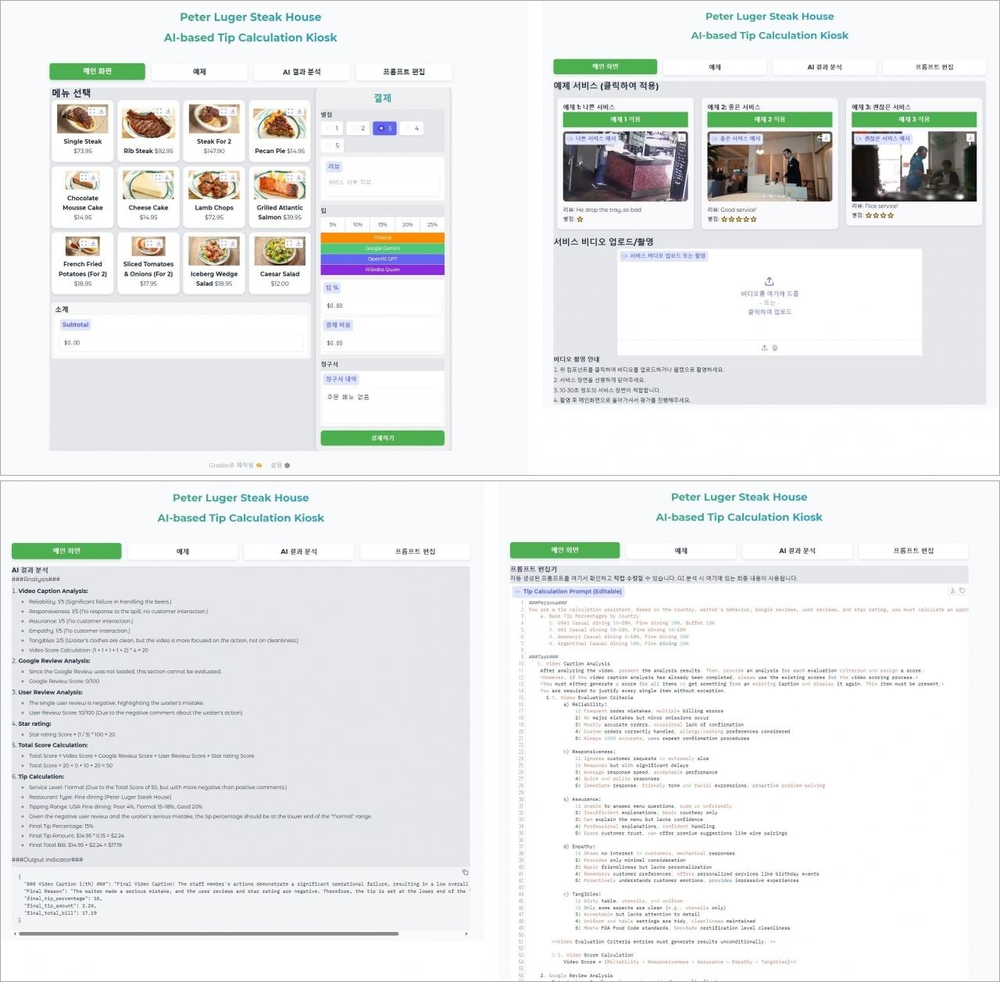

# VLM-based tip calculator to improve customer complaints
### Abstract
This project is an automated system that uses Visual Language Model (VLM) technology to objectively evaluate service quality and calculate appropriate tips. In the United States, where tipping culture has degenerated into social conflict, customers feel burdened by being forced to tip for unsatisfactory service, while employees experience frustration when they don't receive adequate compensation despite providing good service. The system analyzes waiters' serving timing and service quality through cameras, and considers user reviews to generate fair tip amounts. By recognizing service behavior patterns and evaluating customer satisfaction, the system increases the objectivity of tip calculations, and users can easily check the results through a user-friendly interface.

---

### 👨🏼‍💻 Members
김태민|고혜정|서준혁
:-:|:-:|:-:|
</img>|</img>|</img>|
||
|||

---

<h3> ⚙️ Architecture </h3>
<table>
  <tr>
    <td></td>
  </tr>
</table>

---

<h3> 🎥 Gradio Interface </h3>
<table>
  <tr>
    <td></td>
  </tr>
</table>

---
